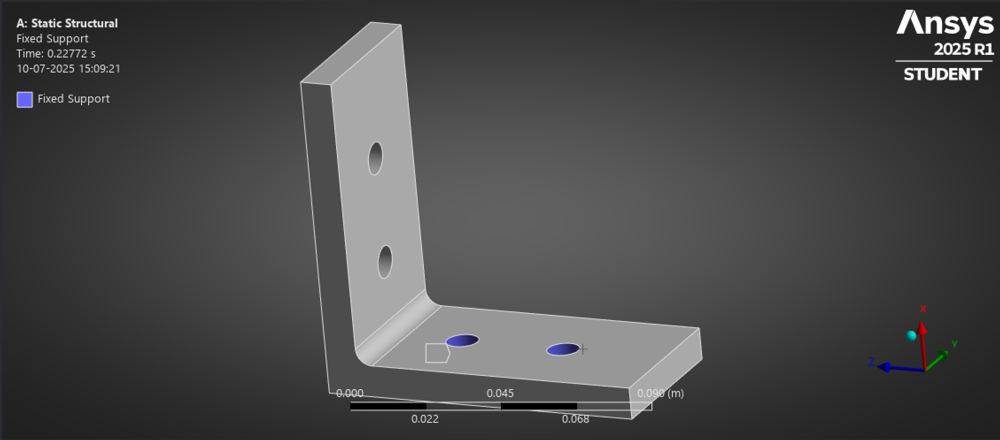
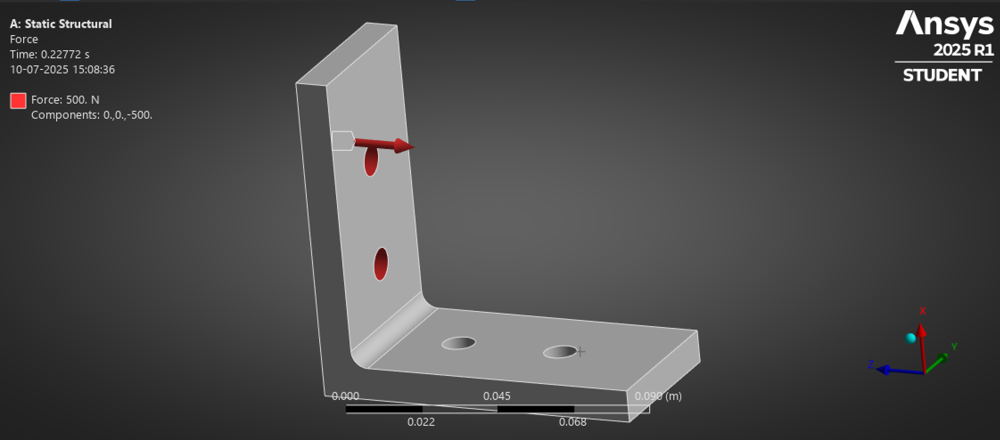
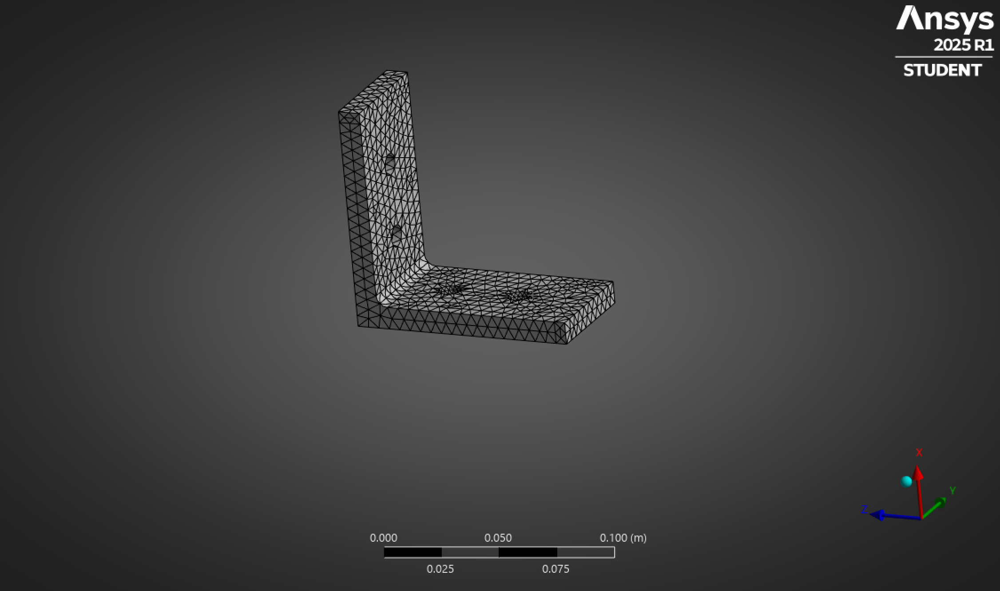
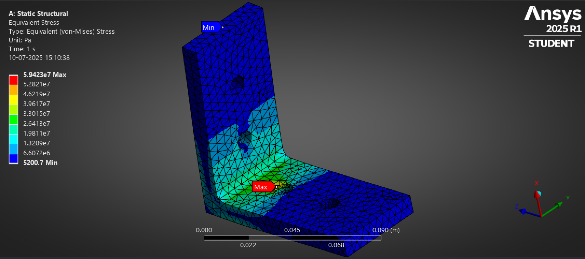

# 🔩 Mounting Bracket Design + Static FEA Simulation

> 🚀 First mechanical simulation project using CAD + FEA tools  
> Designed, simulated, and documented by **Neelay Jain**

---

## 🧠 Overview

This project focuses on designing an L-shaped mechanical bracket and evaluating its structural performance under a 500N load using Finite Element Analysis in ANSYS Workbench.

---

## 🛠 Tools & Technologies

- SolidWorks 2024
- ANSYS Workbench
- GitHub (project hosting)

---

## 📐 CAD Design

- 100mm × 100mm × 10mm L-bracket
- 2 bolt holes per arm (10mm Ø)
- Material: Aluminum 6061  
- Fillet radius: 5mm

📸 *CAD Preview:*  

---

## 🧷 Boundary Conditions

- **Fixed Support**: Inner faces of base holes  
- **Force**: 500N on upper arm holes (Z-direction)

📸 *Boundary Conditions:*  

---

## 🧮 Mesh

- Global size: 5 mm  
- Local size at holes: 2 mm  
- Type: Tetrahedral mesh

📸 *Mesh View:*  

---

## 📊 Results

| Metric               | Value |
|----------------------|-------|
| Max Von Mises Stress | 5.93e004 MPa  
| Max Deformation      | 0.107 mm  
| Factor of Safety     | 0-15  

📸 *Stress Plot:*  

📸 *Deformation Plot:*  

---

## 📄 Full Report

→ [Download Bracket_Project_Report.pdf](Report/Bracket_Project_Report.pdf)

---

## 🧠 Key Learnings

- FEA setup & boundary condition logic  
- Importance of mesh refinement  
- Full design-analysis-documentation workflow

---

## ✅ Status

✅ Completed – July 2025  

